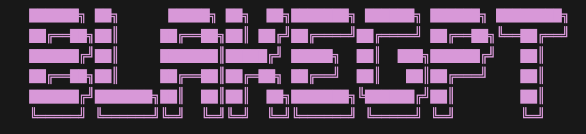

This is an attempt to mimic Nano Chat (Andrej Karparthy's repository)

This repository is a full stack implementation of a LLM like ChatPGT inside a simple code base. this will be run on my DGX spark once it is done.

Will be posting results there
